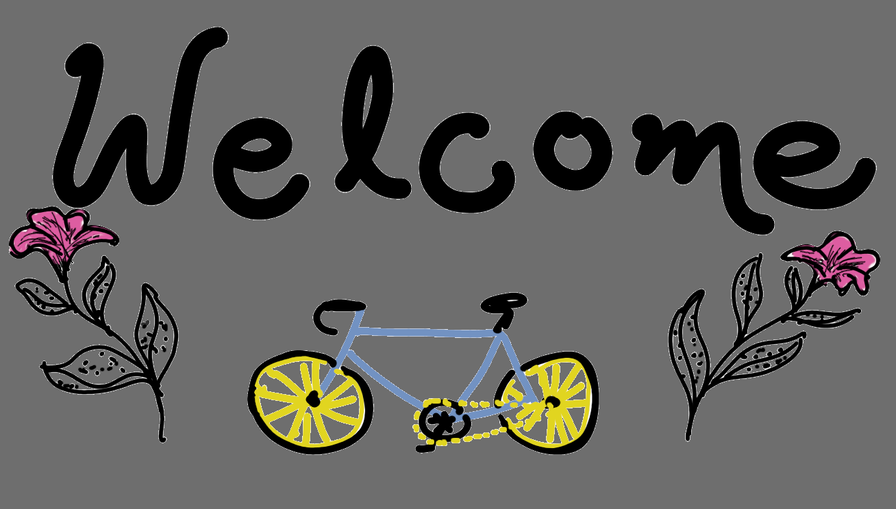

  

<!--- 

  안녕!

 --->

## 🤔 About me.

  

    I'm a Mathematician :coffee: and Musician from Mexico, I main flute, and do guitar as a secondary instrument :notes:. Also I have a passion for programming, introduced to it thanks to GNU/Linux :penguin:.
  

<ul>
<li>🔭 My thesis subject is on the hypergeometric differential equation.</li>
<li>🌱 Expanding constantly on Python to get better at Data Analysis, C++ for Linux stuff, and CSS to make stuff pretty, besides math.</li>
<li>💻 Linux enthusiast with interest in UI/UX; Rofi and EWW themes incoming.</li>
<li>🐧 Feel free to check out my <a href="https://github.com/celepharn/Linux-dotfiles">i3, hyprland and Qtile configs</a>.</li>
</ul>

## 👋 You can reach me at

